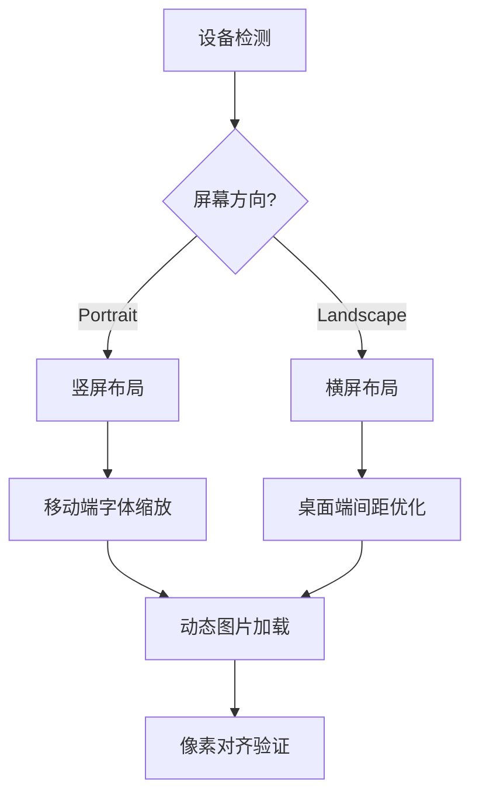

## 以下来自 DeepSeek
以下是为实现跨设备适配（重点针对720p/1080p）设计的完整解决方案，包含核心策略、实现代码和最佳实践：

---

### **一、视口与分辨率适配体系**

#### 1. 视口基础配置
```html
<meta name="viewport" content="width=device-width, 
       initial-scale=1.0, 
       maximum-scale=1.0,
       minimum-scale=1.0,
       viewport-fit=cover">
```

#### 2. 分辨率适配公式
```scss
// 基准设计尺寸（以1080p为基准）
$base-design-width: 1920px;
$base-design-height: 1080px;

// 动态计算缩放比例
:root {
  --scale-ratio: calc(100vw / #{$base-design-width});
  --vh-ratio: calc(100vh / #{$base-design-height});
  
  @media (max-aspect-ratio: 16/9) {
    --scale-ratio: calc(100vh / #{$base-design-height});
  }
}
```

---

### **二、响应式布局方案**

#### 1. 弹性布局架构
```css
.container {
  display: grid;
  grid-template-columns: 
    repeat(auto-fit, minmax(300px, 1fr));
  gap: clamp(1rem, 2vw, 2rem);
  
  @media (orientation: portrait) {
    grid-auto-flow: row;
  }
}
```

#### 2. 断点设置策略
```scss
// 基于设备类型的断点
$breakpoints: (
  mobile:  720px,   // 720p竖屏
  tablet:  1080px,  // 1080p竖屏
  desktop: 1280px
);

@mixin respond-to($device) {
  $width: map-get($breakpoints, $device);
  @media (min-width: $width) and (max-height: $width * 9/16) {
    @content;
  }
}

// 使用示例
.card {
  width: 100%;
  @include respond-to(desktop) {
    width: 30vw;
  }
}
```

---

### **三、图片适配最佳实践**

#### 1. 响应式图片实现
```html
<picture>
  <!-- 1080p+ 设备 -->
  <source 
    media="(min-width: 1920px)"
    srcset="image-2x.webp 2x,
            image-1x.webp 1x">
  
  <!-- 720p 设备 -->
  <source
    media="(max-width: 1280px)"
    srcset="image-mobile-2x.jpg 2x,
            image-mobile-1x.jpg 1x">
  
  <!-- 默认加载 -->
  
</picture>
```

#### 2. CSS 图片优化
```css
.responsive-image {
  width: 100%;
  height: auto;
  max-width: 100vw;
  
  /* 保持宽高比 */
  aspect-ratio: 16/9;
  
  /* 动态缩放 */
  transform: scale(calc(var(--scale-ratio) * 0.95));
  
  /* 锐化处理 */
  image-rendering: -webkit-optimize-contrast;
  image-rendering: crisp-edges;
}
```

---

### **四、文字清晰度保障方案**

#### 1. 动态字体系统
```scss
:root {
  --base-font-size: clamp(14px, 1vw + 8px, 18px);
  --line-height-ratio: 1.6;
}

body {
  font-size: var(--base-font-size);
  line-height: var(--line-height-ratio);
  
  /* 抗锯齿优化 */
  -webkit-font-smoothing: antialiased;
  text-rendering: optimizeLegibility;
}

h1 {
  font-size: calc(var(--base-font-size) * 2.5);
  @media (max-width: 720px) {
    font-size: calc(var(--base-font-size) * 2);
  }
}
```

#### 2. 像素级对齐优化
```css
.text-container {
  /* 防止字体缩放抖动 */
  contain: strict;
  
  /* 亚像素对齐 */
  transform: translateZ(0);
  
  /* 移动端增强 */
  @media (hover: none) {
    letter-spacing: 0.02em;
    word-spacing: 0.05em;
  }
}
```

---

### **五、设备像素比优化**

#### 1. 高分屏检测
```javascript
const DPR = window.devicePixelRatio || 1;

// 动态加载资源
function loadOptimalImage() {
  const img = new Image();
  img.src = DPR >= 2 ? 'image@2x.jpg' : 'image.jpg';
  return img;
}

// 动态设置根字体
document.documentElement.style.setProperty(
  '--dpr-scale', 
  Math.min(DPR, 2)  // 限制最大缩放倍数
);
```

#### 2. Canvas 优化
```javascript
const canvas = document.createElement('canvas');
const ctx = canvas.getContext('2d');

function setCanvasSize(width, height) {
  canvas.width = width * window.devicePixelRatio;
  canvas.height = height * window.devicePixelRatio;
  canvas.style.width = `${width}px`;
  canvas.style.height = `${height}px`;
  ctx.scale(DPR, DPR);
}
```

---

### **六、调试与验证方案**

#### 1. 视口模拟测试
```javascript
// 常用测试分辨率列表
const testResolutions = [
  { name: '720p手机', width: 720, height: 1280 },
  { name: '1080p平板', width: 1080, height: 1920 },
  { name: '4K桌面', width: 3840, height: 2160 }
];

function simulateViewport() {
  testResolutions.forEach(res => {
    window.innerWidth = res.width;
    window.innerHeight = res.height;
    window.dispatchEvent(new Event('resize'));
    checkLayoutConsistency();
  });
}
```

#### 2. 自动化视觉回归
```javascript
// 使用puppeteer进行截图对比
const diffConfig = {
  threshold: 0.01,
  includeAA: false
};

async function testResponsive() {
  const browser = await puppeteer.launch();
  const page = await browser.newPage();
  
  await page.setViewport({ width: 1280, height: 720 });
  await page.screenshot({ path: 'desktop.png' });

  await page.setViewport({ width: 720, height: 1280 });
  await page.screenshot({ path: 'mobile.png' });

  const result = await resemble.compare(
    'desktop.png', 
    'mobile.png',
    diffConfig
  );
  
  assert(result.misMatchPercentage < 5);
}
```

---

### **七、性能优化策略**

1. **图片加载优化**
```html

```

2. **CSS 渲染优化**
```css
.responsive-element {
  /* 强制GPU加速 */
  will-change: transform;
  /* 避免布局抖动 */
  contain: content;
  /* 优化动画性能 */
  transform: translateZ(0);
}
```

3. **动态资源加载**
```javascript
const breakpointObserver = new ResizeObserver(entries => {
  const width = entries[0].contentRect.width;
  loadResourcesForWidth(width);
});

breakpointObserver.observe(document.body);
```

---

### **八、适配效果示意图**



通过这套方案可以实现：
- 图片在720p到4K屏幕的清晰显示
- 文字在各类设备上的可读性保障
- 布局的自适应流畅切换
- 性能与视觉效果的平衡