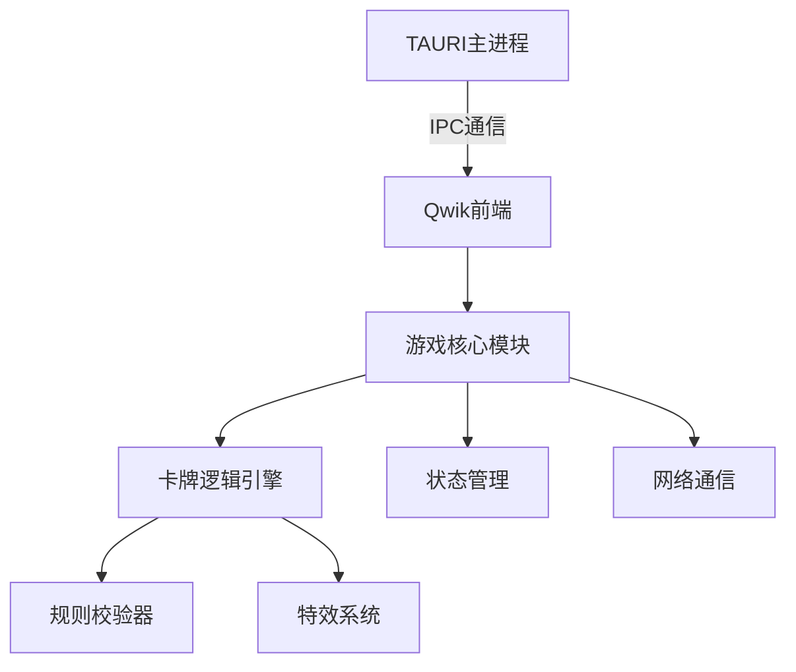

针对使用 **Tauri + Qwik** 技术栈开发类《三国杀》卡牌游戏的架构设计，需要结合桌面端应用特点和卡牌游戏的特殊需求。以下是详细设计方案：

---

### **一、技术栈特性匹配分析**
| 技术          | 优势                          | 游戏开发适用场景                |
|---------------|-----------------------------|---------------------------|
| **Tauri**     | 轻量级桌面端封装（Rust核心）<br>系统API访问能力<br>极小的打包体积 | 桌面版卡牌游戏<br>需要读写本地存档<br>高性能渲染 |
| **Qwik**      | 即时交互式Web应用<br>极致SSR性能<br>细粒度懒加载 | 复杂卡牌UI渲染<br>高频状态更新<br>多玩家实时交互 |

---

### **二、核心架构设计**
#### 1. **混合架构模式**


#### 2. **关键模块分解**
- **游戏引擎层**（Rust实现）：
  - 卡牌效果解析器（技能结算/伤害计算）
  - 回合状态机（Phase Controller）
  - 本地存档加密（使用Tauri fs API）

- **表现层**（Qwik优化）：
  - 动态卡牌组件（Qwik组件懒加载）
  - 动画系统（CSS Transition + WebGL）
  - 音效管理器（Howler.js集成）

- **网络模块**：
  - 双模式支持：WebSocket（在线对战） + LAN发现（本地联机）
  - 消息协议：Protobuf二进制编码

---

### **三、性能优化专项**
1. **卡牌渲染优化**：
   - 使用Qwik的`<Partytown>`将AI逻辑移出主线程
   - 卡牌贴图预加载（Tauri资源打包进二进制）
   - 虚拟列表技术（用于手牌区滚动）

2. **状态同步方案**：
   ```typescript
   // 采用差分状态更新
   export const useGameState = createStore({
     state: {},
     actions: {
       patchState(diff) {
         // 使用JSON-Patch协议
       }
     }
   });
   ```

3. **Rust关键路径加速**：
   ```rust
   // 技能结算的Rust实现示例
   #[tauri::command]
   fn calculate_damage(
     attacker: CardData, 
     defender: CardData
   ) -> HashMap<String, i32> {
     let mut result = HashMap::new();
     result.insert("damage".into(), attacker.attack - defender.defense);
     result
   }
   ```

---

### **四、典型流程实现**
**卡牌使用场景**：
1. 玩家拖拽卡牌到战场区
2. Qwik发送IPC事件到Tauri后端
3. Rust引擎校验规则合法性
4. 返回结算结果并触发Qwik动画
5. 广播状态更新到其他客户端

**关键代码片段**：
```javascript
// Qwik组件事件处理
export const CardComponent = component$(({ card }) => {
  return (
    <div 
      draggable 
      onDragEnd$={(e) => {
        const target = document.elementFromPoint(e.clientX, e.clientY);
        if (target?.closest('.battlefield')) {
          window.__TAURI__.invoke('play_card', { cardId: card.id });
        }
      }}
    >
      <CardImage src={card.image}/>
    </div>
  );
});
```

---

### **五、安全与部署方案**
1. **反作弊措施**：
   - 核心逻辑校验放在Rust端
   - 关键操作签名验证（HMAC-SHA256）

2. **打包配置**：
   ```toml
   # tauri.conf.json
   "bundle": {
     "targets": ["nsis", "dmg", "appimage"],
     "resources": ["cards/*.png"]
   }
   ```

3. **更新策略**：
   - 差量更新（通过Tauri updater）
   - 卡牌数据热加载（JSON文件动态读取）

---

### **六、扩展性设计**
1. **MOD支持架构**：
   - 卡牌数据采用JSON Schema定义
   - 技能脚本使用Lua扩展（通过Rust mlua集成）

2. **AI对战模块**：
   - 决策树算法（Rust实现）
   - 训练数据持久化（SQLite本地存储）

---

### **避坑指南**
1. **Tauri特定问题**：
   - 解决跨平台菜单栏差异（需配置`tauri-menu`）
   - 处理Windows Defender误报（需要代码签名）

2. **Qwik优化点**：
   - 避免Qwik的resumability与游戏状态冲突
   - 使用`useVisibleTask$`处理渲染后操作

3. **性能平衡**：
   - 复杂计算走Rust（如牌堆概率计算）
   - 高频UI更新保留在Qwik（如动画效果）

---

这种架构既利用了Tauri的桌面端能力（特别是需要反作弊的卡牌游戏场景），又通过Qwik实现了动态交互的Web优势。建议搭配Electron作为备选方案做性能对比测试。